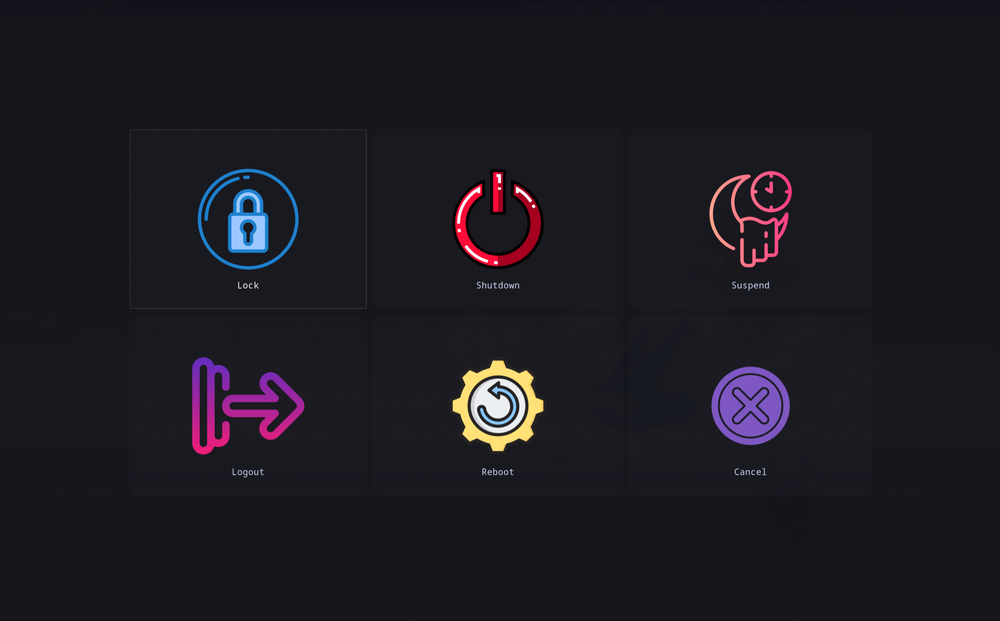

# hyprland-dotfi


<div  align="center">
  
[](https://github.com/rx-py/hyprland-dotfi.git)
[](https://github.com/rx-py/hyprland-dotfi.git)
<a href="https://github.com/rx-py/hyprland-dotfi/blob/main/LICENSE">
    
</a>
</div>

This repo holds the dotfiles for my hyprland setup on Arch Linux. [Hyprland](https://wiki.hyprland.org/). I intend to keep adding on this.


## Installation

To use these configuration files, you need to have Hyprland and some dependences installed on your system. You can install it by running the following command:

```bash
yay -Syu base-devel hyprland feh pywal-git dunst zsh pamixer playerctl brightnessctl kitty neofetch thunar rofi ranger pulseaudio alsa-utils neovim vim git firefox xrander network-manager-applet networkmanager pavucontrol waybar swaybg swaylock sddm gtop flameshot firewalld eza cbonsai-git duf cava bluez-utils bluez blueman bitwarden asciiquarium --noconfirm --needed
```


## Usage

To use these configuration files, simply copy the contents of this repository to which ever directory you would like.


```bash
git clone https://github.com/rx-py/hyprland-dotfi.git 
cd hyprland-dotfi
```

```bash
cp -R ./. ~/
```

## Configuration Files

The following configuration files are included in this repository:

- `.configs`: This folder holds the main configs for the apps I use along with hyprland
- `scripts`: This folder contains system scripts that allows for better functionality.
- `wal`: This folder would be where all images are stored


nvim theme = [everforest](https://github.com/sainnhe/everforest)


## Screenshots



